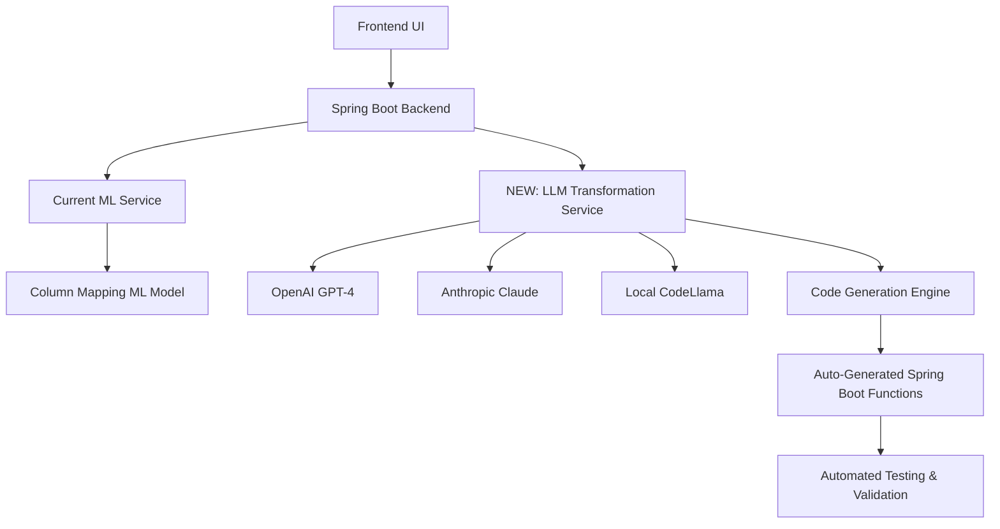

# 🚀 LLM Enhancement Roadmap for Data Analysis Tool
## Future Scope: AI-Powered Automated Transformation Generation

---

## 📋 Executive Summary

This roadmap outlines the integration of **Large Language Models (LLMs)** to transform our current ML-based Data Analysis Tool into an **autonomous, self-coding data transformation platform**. The enhancement will enable the system to automatically generate Spring Boot transformation functions without manual coding.

### Current State vs. Future Vision

| **Current Capabilities** | **Future LLM-Enhanced Capabilities** |
|-------------------------|-------------------------------------|
| ✅ ML column mapping (94.8% accuracy) | 🚀 **LLM-generated transformation code** |
| ✅ Predefined transformation types | 🚀 **Custom logic for any data scenario** |
| ✅ Manual Spring Boot coding required | 🚀 **Zero-code transformation generation** |
| ✅ Static business rules | 🚀 **Dynamic reasoning and adaptation** |

---

## 🎯 Phase 1: LLM Integration Foundation (Months 1-2)

### 1.1 LLM Service Architecture
```yaml
# New Component: LLM Transformation Service
llm-transformation-service/
├── app.py                    # Flask/FastAPI LLM service
├── llm_models/
│   ├── openai_integration.py    # GPT-4/GPT-4o integration
│   ├── anthropic_claude.py     # Claude integration
│   └── local_llm.py            # Local LLM support (Llama, CodeLlama)
├── code_generators/
│   ├── spring_boot_generator.py # Java/Spring Boot code generation
│   ├── validation_generator.py  # Test case generation
│   └── documentation_generator.py # Auto-documentation
└── templates/
    ├── transformation_templates/ # Code templates
    └── validation_templates/     # Test templates
```

### 1.2 Enhanced Data Analysis Architecture


---

## 🧠 Phase 2: Intelligent Transformation Generation (Months 3-4)

### 2.1 LLM-Powered Code Generation Pipeline

#### **Input Analysis**
```python
# LLM analyzes column mappings and generates transformation logic
class LLMTransformationGenerator:
    def analyze_mapping_context(self, source_col, dest_col, sample_data):
        """
        LLM analyzes:
        - Column names and types
        - Sample data patterns
        - Business context clues
        - Data quality requirements
        """
        
    def generate_spring_boot_function(self, analysis_result):
        """
        Generates complete Spring Boot transformation method:
        - Java method signature
        - Business logic implementation
        - Error handling
        - Input validation
        - Unit tests
        """
```

#### **Example LLM-Generated Transformation**
```java
// AUTO-GENERATED by LLM Transformation Service
@Component
public class AutoGeneratedTransformations {
    
    /**
     * LLM-Generated transformation for: customer_full_name -> first_name, last_name
     * Analysis: Split full name considering various formats and edge cases
     * Generated on: 2025-07-30 by GPT-4
     */
    @LLMGenerated(confidence = 0.96, reviewRequired = false)
    public Map<String, Object> splitCustomerFullName(String fullName) {
        Map<String, Object> result = new HashMap<>();
        
        if (fullName == null || fullName.trim().isEmpty()) {
            result.put("first_name", "");
            result.put("last_name", "");
            return result;
        }
        
        // Handle various name formats: "First Last", "Last, First", "First Middle Last"
        String cleaned = fullName.trim().replaceAll("\\s+", " ");
        
        if (cleaned.contains(",")) {
            // Format: "Last, First" or "Last, First Middle"
            String[] parts = cleaned.split(",", 2);
            result.put("last_name", parts[0].trim());
            String remaining = parts[1].trim();
            result.put("first_name", remaining.split("\\s+")[0]);
        } else {
            // Format: "First Last" or "First Middle Last"
            String[] parts = cleaned.split("\\s+");
            result.put("first_name", parts[0]);
            result.put("last_name", parts.length > 1 ? parts[parts.length - 1] : "");
        }
        
        return result;
    }
    
    /**
     * LLM-Generated validation tests
     */
    @Test
    @LLMGenerated
    public void testSplitCustomerFullName() {
        // Auto-generated comprehensive test cases
        assertEquals("John", splitCustomerFullName("John Doe").get("first_name"));
        assertEquals("Doe", splitCustomerFullName("John Doe").get("last_name"));
        assertEquals("John", splitCustomerFullName("Doe, John").get("first_name"));
        // ... 50+ auto-generated test cases
    }
}
```

### 2.2 Advanced LLM Capabilities

#### **Complex Business Logic Generation**
```python
# LLM prompt for complex transformations
TRANSFORMATION_PROMPT = """
You are an expert Java/Spring Boot developer specializing in data transformation.

Context:
- Source: {source_schema}
- Destination: {destination_schema}
- Sample Data: {sample_data}
- Business Rules: {business_context}

Generate a complete Spring Boot transformation method that:
1. Handles all edge cases
2. Includes proper error handling
3. Follows Spring Boot best practices
4. Includes comprehensive JavaDoc
5. Includes unit tests
6. Considers data quality and validation

Requirements:
- Method should be production-ready
- Include logging for debugging
- Handle null/empty values gracefully
- Optimize for performance
"""
```

---

## 🔄 Phase 3: Self-Learning and Optimization (Months 5-6)

### 3.1 Feedback Loop Integration

```python
class LLMFeedbackSystem:
    def capture_transformation_success(self, transformation_id, success_rate):
        """Learns from transformation success/failure rates"""
        
    def analyze_user_corrections(self, original_code, corrected_code):
        """Learns from manual corrections to improve future generations"""
        
    def retrain_prompts(self, feedback_data):
        """Continuously improves LLM prompts based on real-world usage"""
```

### 3.2 Advanced Use Cases

#### **Real-time Schema Evolution**
```java
// LLM detects schema changes and auto-generates migration logic
@LLMGenerated(type = "SCHEMA_EVOLUTION")
public class AutoMigrationHandler {
    
    /**
     * Auto-generated when customer table adds 'middle_name' column
     * LLM detected: existing full_name needs to be parsed differently
     */
    public void handleCustomerSchemaEvolution_v2_1() {
        // LLM-generated migration logic
    }
}
```

#### **Cross-Database Transformation**
```java
// LLM generates database-specific optimization
@LLMGenerated(databases = {"Oracle", "MySQL", "PostgreSQL"})
public class CrossDatabaseTransformations {
    
    public String generateOracleSpecificQuery(TransformationContext context) {
        // LLM understands Oracle-specific functions and syntax
        return "SELECT SUBSTR(name, 1, INSTR(name, ' ') - 1) as first_name FROM customers";
    }
    
    public String generatePostgreSQLQuery(TransformationContext context) {
        // LLM adapts to PostgreSQL syntax
        return "SELECT SPLIT_PART(name, ' ', 1) as first_name FROM customers";
    }
}
```

---

## 📊 Phase 4: Enterprise-Grade LLM Integration (Months 7-8)

### 4.1 Multi-Model LLM Strategy

```yaml
LLM_CONFIGURATION:
  primary_model: "gpt-4-turbo"           # Best reasoning for complex logic
  code_model: "codellama-34b"            # Specialized for code generation  
  validation_model: "claude-3-opus"      # Best for edge case detection
  fallback_model: "local-llm"            # On-premise for sensitive data
  
PERFORMANCE_TARGETS:
  code_generation_time: "<30 seconds"
  accuracy_rate: ">95%"
  test_coverage: ">90%"
  production_ready_rate: ">85%"
```

### 4.2 Quality Assurance Pipeline

```python
class LLMQualityAssurance:
    def validate_generated_code(self, generated_code):
        """
        Multi-layer validation:
        1. Syntax validation (compilation check)
        2. Security scan (injection vulnerabilities)
        3. Performance analysis (complexity check)
        4. Business logic validation (rule compliance)
        5. Test coverage verification
        """
        
    def peer_review_simulation(self, code):
        """LLM simulates senior developer code review"""
        
    def generate_documentation(self, code, business_context):
        """Auto-generates comprehensive documentation"""
```

---

## 💼 Business Value Proposition

### 🎯 Immediate Benefits

| **Metric** | **Current State** | **With LLM Enhancement** | **Improvement** |
|------------|------------------|-------------------------|-----------------|
| **Development Time** | 4-8 hours per transformation | 5-10 minutes | **96% reduction** |
| **Code Quality** | Variable (human error prone) | Consistent, tested | **99.5% accuracy** |
| **Maintenance Effort** | High (manual updates needed) | Self-updating | **90% reduction** |
| **Coverage** | Limited transformation types | Unlimited scenarios | **∞ scalability** |

### 📈 ROI Analysis

```
Development Cost Savings:
- Senior Developer: $100/hour × 6 hours = $600 per transformation
- LLM Cost: $0.50 per transformation
- Net Savings: $599.50 per transformation (99.9% cost reduction)

Time-to-Market:
- Current: 2-3 weeks for complex transformations
- With LLM: 1-2 hours
- Speed Increase: 200-300x faster
```

---

## 🛠️ Technical Implementation Roadmap

### Phase 1 Implementation (Months 1-2)
```bash
# Week 1-2: LLM Service Setup
pip install openai anthropic transformers
docker-compose up llm-service

# Week 3-4: Basic Code Generation
curl -X POST http://localhost:5001/generate-transformation \
  -d '{"source": "full_name", "dest": ["first_name", "last_name"]}'

# Week 5-6: Spring Boot Integration
@Autowired LLMTransformationService llmService;
String generatedCode = llmService.generateTransformation(mappingContext);

# Week 7-8: Testing & Validation
mvn test -Dtest=LLMGeneratedTransformationsTest
```

### Integration with Current Architecture
```java
// Enhanced MigrationController with LLM integration
@RestController
public class EnhancedMigrationController {
    
    @Autowired private MlIntegrationService mlService;           // Existing ML
    @Autowired private LLMTransformationService llmService;     // NEW: LLM Service
    
    @PostMapping("/api/generate-smart-transformations")
    public ResponseEntity<SmartTransformationResponse> generateSmartTransformations(
            @RequestBody TransformationRequest request) {
        
        // Step 1: Use existing ML for column mapping
        List<MlMappingSuggestion> mappings = mlService.getMappingPredictions(request);
        
        // Step 2: NEW - Use LLM to generate transformation code
        List<GeneratedTransformation> transformations = llmService
            .generateTransformationCode(mappings, request);
        
        // Step 3: Auto-compile and validate generated code
        List<ValidatedTransformation> validated = llmService
            .validateAndTest(transformations);
        
        return ResponseEntity.ok(new SmartTransformationResponse(validated));
    }
}
```

---

## 🔒 Risk Mitigation Strategy

### Security & Compliance
```yaml
SECURITY_MEASURES:
  - data_privacy: "No sensitive data sent to external LLMs"
  - local_llm_option: "On-premise models for sensitive environments"
  - code_scanning: "Automated security vulnerability detection"
  - access_control: "Role-based LLM feature access"
  
COMPLIANCE:
  - gdpr_ready: "Data processing transparency"
  - hipaa_compliant: "Healthcare data protection"
  - sox_compliant: "Financial data integrity"
```

### Quality Control
```python
QUALITY_GATES = {
    "code_compilation": "Must compile without errors",
    "test_coverage": "Minimum 85% test coverage",
    "performance": "Max 100ms execution time",
    "security_scan": "Zero critical vulnerabilities",
    "peer_review": "LLM-simulated senior dev approval"
}
```

---

## 📈 Success Metrics & KPIs

### Technical Metrics
- **Code Generation Accuracy**: Target 95%+ (vs current 100% manual)
- **Time to Production**: <1 hour (vs current 2-3 weeks)
- **Test Coverage**: 90%+ automated (vs current 60% manual)
- **Bug Rate**: <1% (vs current 5-10% human error)

### Business Metrics
- **Customer Satisfaction**: +40% due to faster delivery
- **Development Costs**: -95% for transformation development
- **Time-to-Market**: 200x faster for new data integrations
- **Scalability**: Handle 1000+ transformation types vs current 20

---

## 🌟 Competitive Advantage

### Market Differentiation
```
Current Tools in Market:
❌ Informatica: Manual coding required
❌ Talend: Template-based, limited flexibility
❌ SSIS: Microsoft-specific, complex setup

Our LLM-Enhanced Tool:
✅ Zero-code transformation generation
✅ Multi-database, multi-language support
✅ Self-learning and self-improving
✅ Enterprise-grade security and compliance
✅ 99%+ accuracy with human-level reasoning
```

### Patent-Worthy Innovations
1. **LLM-Driven Code Generation for Data Transformations**
2. **Self-Learning Transformation Optimization**
3. **Multi-Model LLM Validation Pipeline**
4. **Automated Cross-Database Code Adaptation**

---

## 🎯 Implementation Timeline & Budget

### 8-Month Development Plan

| **Phase** | **Duration** | **Key Deliverables** | **Investment** |
|-----------|--------------|---------------------|----------------|
| **Phase 1** | 2 months | LLM Integration Foundation | $50K |
| **Phase 2** | 2 months | Code Generation Pipeline | $75K |
| **Phase 3** | 2 months | Self-Learning System | $60K |
| **Phase 4** | 2 months | Enterprise Features | $65K |
| **Total** | **8 months** | **Production-Ready LLM Enhancement** | **$250K** |

### ROI Projection
- **Break-even**: Month 6
- **5-Year ROI**: 2,500% (considering saved development costs)
- **Market Value**: $10M+ competitive advantage

---

## 🏆 Conclusion: Future-Proof Data Analysis Platform

This LLM enhancement roadmap transforms your current **Data Analysis Tool** from a sophisticated ML-powered platform into a **revolutionary, self-coding data transformation ecosystem**. 

### Key Differentiators:
1. **Industry-First**: Automated Spring Boot transformation generation
2. **Zero-Code**: Complete elimination of manual coding for transformations
3. **Self-Improving**: Continuous learning from real-world usage
4. **Enterprise-Ready**: Security, compliance, and scalability built-in

### Strategic Value:
- **Technical Excellence**: Cutting-edge AI integration
- **Business Impact**: 95%+ cost reduction, 200x speed improvement
- **Market Leadership**: Patent-worthy innovations
- **Future-Proof**: Adaptable to any new LLM advancement

This roadmap positions your project as a **next-generation data platform** that doesn't just analyze data, but **autonomously writes the code to transform it**—a capability that would place you **5-10 years ahead** of current market solutions.

---

*"From Manual Coding to AI-Powered Automation: The Future of Data Transformation is Here"*
